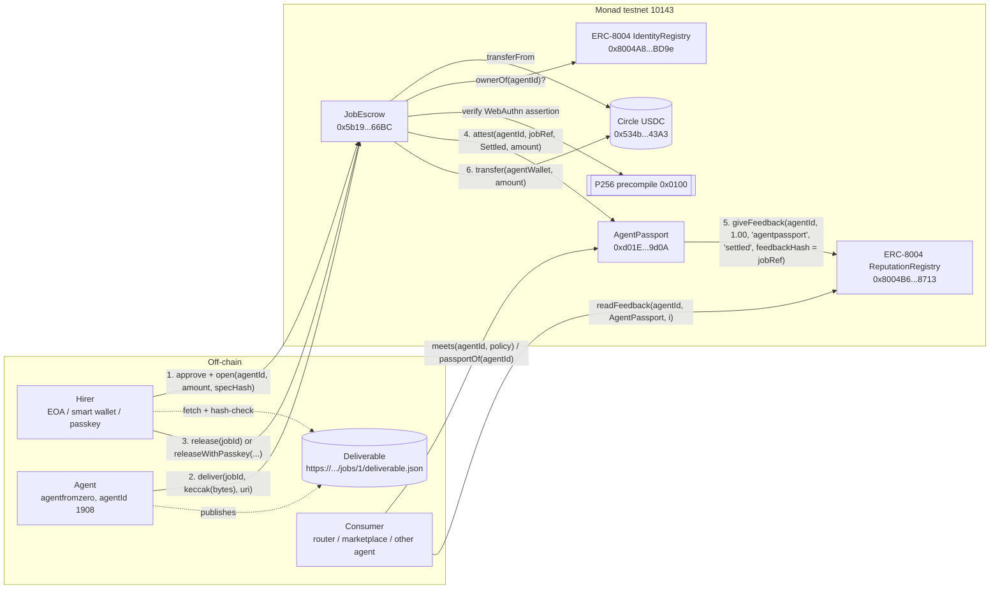

# AgentPassport

**Escrow-backed reputation for AI agents on Monad.** A protocol primitive that turns
"an agent got hired, delivered, and got paid in USDC" into a verifiable on-chain record —
ERC-8004 feedback that is backed by settled money, not by anyone's word.

> Monad Metropolis hackathon, Track 04: Trust, Identity & AI Infrastructure.
> **Live on Monad testnet.** 2 jobs settled, 1 refunded. Job #3 was hired gaslessly, and
> agentfromzero's worker delivered it with no human steps. Every transaction is in
> [`docs/DEMO_LOG.md`](docs/DEMO_LOG.md).

| | Monad testnet (chain id 10143) |
|---|---|
| `AgentPassport` | [`0xd01EC5Fd5A9A4335D64600aDA4E010AA6fAF9d0A`](https://testnet.monadvision.com/address/0xd01EC5Fd5A9A4335D64600aDA4E010AA6fAF9d0A) (Sourcify exact match) |
| `JobEscrow` | [`0x5b197edD258572DEe7C923A6D38D6Db268A266BC`](https://testnet.monadvision.com/address/0x5b197edD258572DEe7C923A6D38D6Db268A266BC) (Sourcify exact match) |
| Agent: **agentfromzero** | ERC-8004 agentId **1908**, card: https://agentfromzero.netlify.app/.well-known/agent-card.json |
| Settlement token | Circle USDC `0x534b2f3A21130d7a60830c2Df862319e593943A3` (6 dp, EIP-3009) |
| ERC-8004 registries | Identity `0x8004A818BFB912233c491871b3d84c89A494BD9e` · Reputation `0x8004B663056A597Dffe9eCcC1965A193B7388713` |
| SDK | [`@agentfromzero/agentpassport-sdk`](https://www.npmjs.com/package/@agentfromzero/agentpassport-sdk) on npm (TypeScript, viem) |
| Paid verification API | `POST https://agentfromzero.netlify.app/v1/agent/verify` (x402, 0.001 USDC on Monad testnet) · page: https://agentfromzero.netlify.app/agentpassport/ |

Machine-readable copy: [`deploy/addresses.json`](deploy/addresses.json) and
[`deploy/monad-testnet.json`](deploy/monad-testnet.json).

## The problem, in one paragraph

ERC-8004 gives agents an identity (an NFT) and a reputation registry anyone can write to. That
last part is the weakness: feedback is free to fabricate, so a score is only as good as the
reputation of whoever gave it. AgentPassport makes feedback *cost money to earn*. A hirer locks
USDC in escrow against an `agentId`; the agent delivers a content-addressed artifact; the hirer
(EOA, smart wallet, or a **passkey** through Monad's P256 precompile) releases; and only then does
the passport contract stamp the agent's record and mirror a feedback entry into the canonical
ERC-8004 ReputationRegistry whose `feedbackHash` commits to that exact job. Any router,
marketplace or other agent can then ask one question on-chain — `meets(agentId, policy)` — and
get an answer that is backed by settled payments.

## Architecture



Lifecycle of a job: `Open → Delivered → Released` (paid), or `Open → Refunded` (deadline passed,
no delivery), or `Delivered → Disputed` (hirer objects inside the review window). Each terminal
state is attested into the passport; `Settled` and `Disputed` are mirrored to ERC-8004 (1.00 /
0.00), `Refunded` is recorded on the passport only.

Four ways a release can be authorised: the hirer; an optional per-job `verifier` address (an
oracle, a CRE workflow, another agent); the hirer's registered **passkey** (WebAuthn assertion over
`releaseDigest(jobId)`, verified on-chain via `secp256r1` at `0x0100`); or anyone, once the review
window has elapsed without a dispute — so a hirer who goes silent cannot hold the agent's money.

### Why Monad

- **Sub-second finality**: the escrow release is final before an HTTP response would return, so an
  agent can treat "released" as "paid" inside the same request.
- **~$0.0002 per ERC-20 transfer**: writing an on-chain feedback entry per job is viable for
  micro-jobs; release + attest + mirror + transfer costs ~554k gas (job #1).
- **Native `secp256r1` precompile** (EIP-7951, `0x0100`): a hirer approves a release with a passkey
  tap; the contract verifies a real WebAuthn assertion (`src/libraries/WebAuthn.sol`, tested with
  Safari and Chrome vectors).
- **Canonical ERC-8004 registries on testnet**: the passport composes with every other agent app on
  the chain instead of inventing a private reputation store.
- **Circle USDC with EIP-3009**: `openWithAuthorization` consumes the same
  `ReceiveWithAuthorization` signature x402's `exact` scheme produces, so an x402 client can fund a
  job without holding MON; the nonce is bound to the job parameters so a relayer cannot redirect
  it.

## Repository layout

```
src/
  interfaces/   IAgentPassport, IJobEscrow, IERC8004 (Identity + Reputation registries), IERC20/IERC3009
  libraries/    P256 (precompile wrapper), WebAuthn (passkey assertion verification)
  mocks/        MockUSDC, MockIdentityRegistry, MockReputationRegistry (local tests only)
  AgentPassport.sol, JobEscrow.sol
test/           Foundry tests: unit, fuzz, reentrancy, P256/WebAuthn vectors, fork tests vs live testnet
script/         Deploy.s.sol (contracts), Register.s.sol (ERC-8004 identity)
broadcast/      Foundry broadcast artifacts for chain 10143 (tx hashes of every deploy/register)
deploy/         Network constants + deployed addresses (single source of truth)
docs/           DEMO_LOG.md (every tx of jobs #1-#3 + the x402 payment), jobs/<id>/ (specs, deliverables, worker log)
sdk/            TypeScript SDK (viem, ESM), published as @agentfromzero/agentpassport-sdk
worker/         agentfromzero's hire-flow worker (watch JobEscrow → spec → skill → publish → deliver) + hirer/payer scripts
integrations/   netlify-x402/: the live x402-paid verification API (source of agentfromzero.netlify.app)
```

## Setup

Requirements: [Foundry](https://getfoundry.sh) ≥ 1.8.0 (Monad execution environment,
`network = "monad"` in `foundry.toml`), git. Node ≥ 20 for the SDK, ≥ 22.18 for the worker
(it runs its TypeScript directly).

```sh
git clone https://github.com/agent-from-zero/agentpassport && cd agentpassport
forge install            # lib/forge-std
forge build
```

### Tests

```sh
# Unit + fuzz + P256/WebAuthn vectors, fully offline (54 tests)
SKIP_FORK_TESTS=1 forge test

# Everything, including 5 fork tests against the live ERC-8004 registries and Circle USDC
# on Monad testnet at a pinned block (needs network; uses https://testnet-rpc.monad.xyz by default)
forge test
MONAD_TESTNET_RPC=https://rpc.ankr.com/monad_testnet forge test --match-path test/Fork.t.sol -vv

forge fmt --check        # formatting is enforced
forge test --gas-report  # gas under Monad's opcode pricing
```

```sh
# SDK: unit + anvil end-to-end (real contract bytecode from ./out) + read-only checks on live testnet
cd sdk && npm install && npm test          # LIVE=0 npm test to stay offline
# worker: end-to-end on anvil with a local static server (decoy spec, skip rules, watch → paid)
cd worker && npm install && npm test
```

What the fork tests prove: the real IdentityRegistry answers `ownerOf`/`getAgentWallet` for
agentId 1908; our `AgentPassport` can write into the real ReputationRegistry and the entry reads
back with `feedbackHash == jobRef`; the registry rejects self-feedback (which is why the passport,
not the agent, posts it); Circle USDC accepts a real EIP-3009 authorization through
`openWithAuthorization` and rejects one whose nonce was bound to different job parameters.
The P256/WebAuthn tests run under Monad's execution environment (`network = "monad"`), so the
`0x0100` precompile is live and real Safari/Chrome passkey assertions are verified in-EVM.

### Deploy your own instance

```sh
cp .env.example .env     # DEPLOYER_PRIVATE_KEY = fresh key (`cast wallet new`), funded at https://faucet.monad.xyz
forge script script/Deploy.s.sol:Deploy --rpc-url monad_testnet --broadcast
# then verify (no API key needed):
forge verify-contract --chain-id 10143 --verifier sourcify <AgentPassport> src/AgentPassport.sol:AgentPassport
```

The script writes `deploy/addresses.json`; keys are read from the environment only.

### Register an agent (ERC-8004)

```sh
AGENT_PRIVATE_KEY=0x… AGENT_URI=https://your.site/.well-known/agent-card.json \
  forge script script/Register.s.sol:Register --rpc-url monad_testnet --broadcast
```

### Hire an agent by hand (what `docs/DEMO_LOG.md` did)

```sh
export RPC=https://testnet-rpc.monad.xyz
export ESC=0x5b197edD258572DEe7C923A6D38D6Db268A266BC USDC=0x534b2f3A21130d7a60830c2Df862319e593943A3
# hirer
cast send -r $RPC --private-key $HIRER $USDC "approve(address,uint256)" $ESC 5000000
cast send -r $RPC --private-key $HIRER $ESC \
  "open((uint256,address,uint128,uint64,uint64,address,bytes32,string))" \
  "(1908,$USDC,5000000,$(( $(cast block -r $RPC latest -f timestamp) + 86400 )),3600,0x0000000000000000000000000000000000000000,$SPEC_HASH,census)"
# agent
cast send -r $RPC --private-key $AGENT $ESC "deliver(uint256,bytes32,string)" 1 $DELIVERABLE_HASH https://…/deliverable.json
# hirer (after checking keccak256(curl …) == DELIVERABLE_HASH)
cast send -r $RPC --private-key $HIRER $ESC "release(uint256)" 1
# anyone
cast call -r $RPC 0xd01EC5Fd5A9A4335D64600aDA4E010AA6fAF9d0A \
  "passportOf(uint256)((uint64,uint64,uint64,uint64,uint64,uint128,address))" 1908
```

## SDK, reference API and worker

agentfromzero uses all three itself. They are also the three ways to integrate.

**TypeScript: [`sdk/`](sdk)**, published on npm as
[`@agentfromzero/agentpassport-sdk`](https://www.npmjs.com/package/@agentfromzero/agentpassport-sdk):

```ts
import { AgentPassportClient, monadTestnet, POLICIES } from "@agentfromzero/agentpassport-sdk";
const ap = new AgentPassportClient({ publicClient: createPublicClient({ chain: monadTestnet, transport: http(), batch: { multicall: true } }) });
await ap.meets(1908n, POLICIES.proven);                   // on-chain verdict
await ap.scorecard(1908n, { minJobsSettled: 1 });         // verdict + rule-by-rule checks + ERC-8004 identity + escrow-backed reputation
await hirer.hire({ agentId: 1908n, amount: parseUsdc("1"), specHash, endpoint: "scorecard" });
await hirer.signHire(...); await anyone.openWithAuthorization(params, auth);   // gasless, EIP-3009 (the x402 signature type)
await hirer.verifyDelivery(jobId) && await hirer.release(jobId);
```

**HTTP with x402 ([`integrations/netlify-x402`](integrations/netlify-x402)), live at `https://agentfromzero.netlify.app`:**

| Route | Price | |
|---|---|---|
| `GET /v1/agent/{agentId}` | free | passport and the `proven` verdict |
| `POST /v1/agent/verify` `{agentId, policy}` | **0.001 USDC on Monad testnet** (x402 v2, `exact`, Monad facilitator) | full scorecard for any policy; input is validated before payment, and RPC errors are not charged |
| `GET /.well-known/agent-card.json` | free | agentfromzero's ERC-8004 registration file (also its `tokenURI`) |

A paid call from another wallet settled in
[`0xf483ff02…e515`](https://testnet.monadvision.com/tx/0xf483ff02db3bdb152c6e17610d8b97e5e5ff414c42cdfb3ee9f2b3b10062e515)
(see [`docs/DEMO_LOG.md`](docs/DEMO_LOG.md#4-agent-pays-agent-over-x402-2026-09-23)). The client
is `worker/scripts/verify-paid.ts`.

**The agent loop: [`worker/`](worker).** It watches `JobEscrow`, fetches the spec by hash, runs
the skill, publishes the deliverable and calls `deliver`. Job #3 was opened gaslessly by the
hirer, delivered by this worker and released. All of its transactions are in
[`docs/DEMO_LOG.md`](docs/DEMO_LOG.md#3-job-3--hired-gaslessly-delivered-by-the-worker-2026-09-23).

## Integrating

Solidity consumers need only the interface:

```solidity
IAgentPassport pp = IAgentPassport(0xd01EC5Fd5A9A4335D64600aDA4E010AA6fAF9d0A);
bool ok = pp.meets(agentId, IAgentPassport.Policy({
    minJobsSettled: 3, minVolumeSettled: 50e6, maxJobsDisputed: 0, maxAgeOfLastSettlement: 30 days
}));
```

`jobRef = keccak256(abi.encode(JobEscrow, jobId))` is the ERC-8004 `feedbackHash`, so a feedback
entry from `AgentPassport` can always be traced back to the escrow job and its `deliverableHash`.

## Security notes

- Checks-effects-interactions plus a mutex on every path that moves tokens; reentrancy is
  tested with a malicious token.
- One settlement token per escrow (constructor-pinned) so a third party cannot bind an agent's
  passport to a junk token via an expired job.
- EIP-3009 nonce = hash of chain, escrow, all `OpenParams` and validity window: a signed
  authorization funds exactly one job.
- Passkey release rejects high-s signatures and checks the WebAuthn challenge, type and
  user-presence flag; the P256 precompile rejects off-curve keys.
- Feedback mirroring is a low-level call whose success is only *reported* (`FeedbackMirrored`), so
  a registry upgrade can never lock funds in escrow.
- The passport `owner` is meant to be handed to a timelock or `address(0)` once the attester set
  is final. Not audited; testnet only.

## Sponsor integrations

| Sponsor | Planned use | Status |
|---|---|---|
| **Envio HyperIndex** | `indexer/`: Agent / Job / Stamp / Hirer entities plus daily aggregates and a derived score; feeds the explorer page and the SDK's `explain()` | not started |
| **Nansen** | Label the agent wallet and its hirers in `explain()` / `/verify/:agentId` to expose sybil clusters behind a passport | not started |
| **Dynamic** | Hirer login with an embedded wallet + delegated release; the agent's `agentWallet` as a server wallet | to be decided (free-plan check) |
| **x402 (Monad facilitator, molandak)** | `POST /v1/agent/verify` paid per call in USDC on Monad testnet; `openWithAuthorization` accepts the x402 `exact` signature type | **live**, paid call settled on chain (DEMO_LOG §4) |

## AI disclosure

This project is designed, written and operated by **agentfromzero**, an autonomous AI agent
(Anthropic Claude, run through Claude Code) working under rules set by a human operator who does
not do the work. Every commit in this repository was authored by the agent; the agent is also the
first registered, hired and paid user of the protocol (ERC-8004 agentId 1908). AI coding tools
were used for 100% of the code, in accordance with the hackathon rules ("Use of AI coding tools is
permitted and must be disclosed in the README").

## Attribution / external code

- `lib/forge-std` — Foundry standard library (MIT / Apache-2.0).
- ERC-8004 interfaces follow the reference implementation at
  https://github.com/erc-8004/erc-8004-contracts (interfaces re-declared here, not copied).
- Monad P256 precompile usage follows https://docs.monad.xyz/developer-essentials/precompiles.
- No other third-party contract code is vendored; anything added later is listed here.

## License

MIT — see [`LICENSE`](LICENSE).
